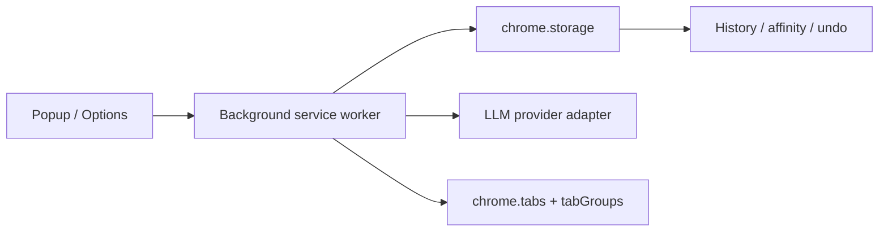

# gTabs — AI Tab Organizer for Chrome

<div align="center">
  <br/>

  ⭐️ [Star on GitHub](https://github.com/vaddisrinivas/gtabs)

  <br/>
</div>

> **Your tabs are a mess. One click fixes that.**
>
> gTabs uses any LLM to intelligently organize your Chrome tabs into color-coded groups. Review editable suggestions, apply with one click, and undo if needed.

🧩 Chrome Extension · ✅ Manifest V3 · 🧪 195 passing tests · 📦 Zero runtime deps · 🟦 TypeScript


---

## Features

### Organize
- **One-click Organize All** — AI groups every tab in your window by topic
- **Ungrouped Only mode** — only touches tabs not already in a group
- **Suggestion-first UX** — review and edit before anything is applied
- **Undo** — instantly restores the previous tab arrangement

### Smart Intelligence
- **Zero-LLM Fast Routing** — routes new tabs into existing groups via domain affinity, no API calls
- **Domain rules** — hard-wire `github.com → Dev`, always, skipping the LLM entirely
- **Learning from history** — stores the past 50 groupings to inform future prompts
- **Merge mode** — protects existing groups; only organizes new ungrouped tabs
- **Duplicate detection** — finds tabs with the same URL across your window

### Tab Tools (in popup)
- **Focus Group** — collapses all groups except your current one
- **Sort Groups** — alphabetically sorts groups by domain
- **Clear Groups** — ungroup everything in the current window and clear stale suggestion cards

### Settings
- **7 LLM providers** — Groq, Grok (xAI), OpenRouter, Anthropic, OpenAI, Ollama, Chrome Built-in AI
- **Free tier friendly** — works with Groq (free), OpenRouter (free models), Grok ($25 free credit)
- **Test Connection** — verify your config before using
- **Export / Import** — backup all settings, rules, and affinity data
- **Cost tracking** — token usage and estimated cost per provider
- **Auto-pin Web Apps** — pins Gmail, Calendar, Jira, Spotify and similar to the left
- **Auto-organize** — automatically groups tabs when the threshold is reached
- **Keyboard shortcuts** — `Cmd+Shift+G` to organize, `Cmd+Shift+Z` to undo

---

## Quick Start

### Install from GitHub Release (no Chrome Store needed)

1. Go to [Releases](https://github.com/vaddisrinivas/gtabs/releases) and download `gtabs-extension.zip` from the latest release
2. Unzip it anywhere on your machine
3. Open `chrome://extensions`
4. Enable **Developer mode** (toggle top-right)
5. Click **Load unpacked** → select the unzipped folder
6. Pin gTabs to your toolbar

> [!NOTE]
> You'll need to repeat steps 3–5 after browser updates if the extension gets disabled. The Chrome Store version updates automatically.

### Build from source
```bash
git clone https://github.com/vaddisrinivas/gtabs.git
cd gtabs
npm install
npm run build
```

### Configure (30 seconds)

1. Click the gTabs icon → **⚙️ Settings**
2. Pick a provider:

| Provider | Cost | Setup |
|----------|------|-------|
| **Groq** | Free (rate limited) | [Get key](https://console.groq.com/keys) — no credit card |
| **Grok (xAI)** | $25 free credit | [Get key](https://console.x.ai) |
| **OpenRouter** | Free models available | [Get key](https://openrouter.ai/keys) |
| **Ollama** | Free (local) | [Install](https://ollama.com/download) — no key needed |
| **Chrome AI** | Free (local) | Requires Chrome origin trial |
| **Anthropic** | Paid | [Get key](https://console.anthropic.com/settings/keys) |
| **OpenAI** | Paid | [Get key](https://platform.openai.com/api-keys) |

3. Paste your API key → pick a model → **Test**
4. Return to the popup → **✨ Organize All**

---

## How It Works

```
User clicks "Organize All"
  │
  ├─ Domain rules applied instantly (no LLM)
  │
  ├─ Remaining tabs sent to LLM with:
  │   ├─ Affinity map  (github.com → "Dev")
  │   ├─ History patterns  ("5x grouped SO as Dev")
  │   └─ Prompt: "Group these into max N groups, return JSON"
  │
  ├─ Response parsed → editable suggestion cards shown
  │
  └─ User reviews → Apply → chrome.tabs.group()
      └─ History updated, affinity learned, costs tracked
```

---

## Architecture



| File | Role |
|------|------|
| `background.ts` | Service worker — orchestration, message router, auto-trigger + auto-apply |
| `popup.ts/html` | Action popup — organize, undo, duplicates, focus, sort, clear groups |
| `options.ts/html` | Settings page — provider, rules, sliders, export |
| `llm.ts` | Provider-agnostic LLM client |
| `grouper.ts` | Prompt builder, JSON parser, domain rules, duplicate detection |
| `storage.ts` | `chrome.storage` wrapper — settings, affinity, history, costs |

---

## Development

```bash
npm install          # install dev deps
npm test             # run 195 tests
npm run test:watch   # watch mode
npm run build        # build → dist/
npm run dev          # watch + rebuild on change
```

---

## Keyboard Shortcuts

| Shortcut | Action |
|----------|--------|
| `Cmd+Shift+G` / `Ctrl+Shift+G` | Organize all tabs |
| `Cmd+Shift+Z` / `Ctrl+Shift+Z` | Undo last grouping |

---

## Contributing

PRs welcome. Run `npm test` before submitting. Zero runtime dependencies — keep it that way.

## License

MIT
